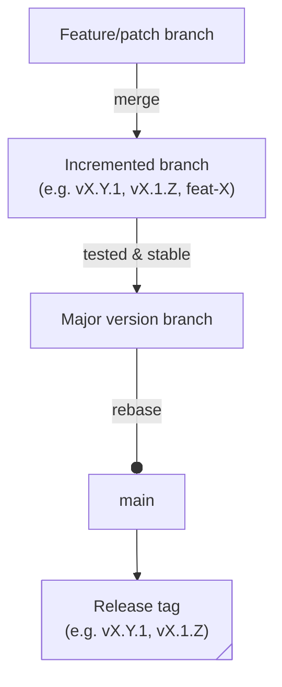

# Contributing

> [!IMPORTANT]
> Prerequisites:
> * [Bun](https://bun.com/docs/installation)
> * [action-docs](https://github.com/npalm/action-docs)

We use Bun as the JavaScript runtime for development.

Make your changes under [`src/`](/src/), run `bun run compile`, and don’t forget to update the action docs with `action-docs --source action.yaml` and reflect the changes in the [README.md](/README.md). Then feel free to submit your PR!

> For maintainers:

When creating release tags, follow the SemVer format (`vX.Y.Z`).

> [!NOTE]
> All changes must be applied to the default HEAD branch as well as the respective major version branch.